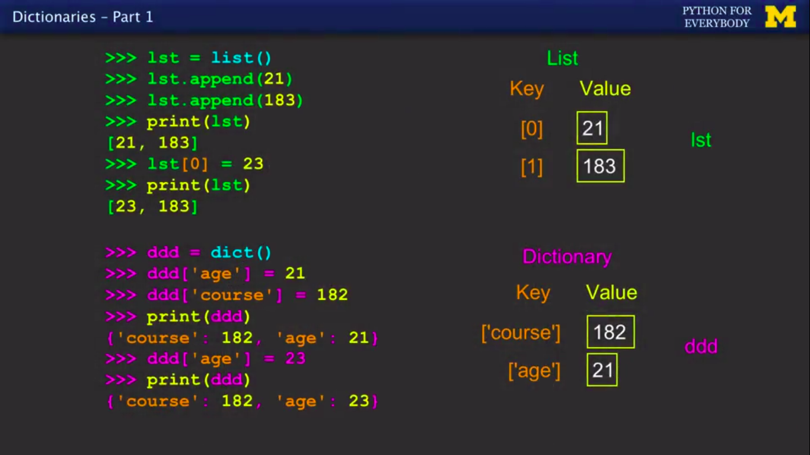

# Python Basics
* Python is a programming language that does not use semicolon at the end of the statement.
* This tutorial is for those who have a basic knowledge of programming in any other language like loops, variables, conditional statements, etc.
* It will be really easy for someone to learn python from these tutorials if he/she has a basic idea of the above topics.

## Print in Python
In Python 2 you can print without using brackets
```
print "Akshay Bengani"
```
This is allowed in Python 2 but not in Python 3 
```
print("Akshay Bengani");
```
This is important we have to use () while in the print function.

## Input in Python
You can take input in python by using the input() function
```
a = input("Enter your name here ");
```
This will take input and store it in a variable

# Python Expressions
Expressions are made up of variables, constants, operators, functions, Reserved Words, Comments, and a lot more cool stuff.

## Comments in Python
To Comment in Python, we use \# to comment out something.

## Type conversion 
In Python when we take the input we use input() function this function only takes string type so we need to typecast when we needed an Integer operation or any other type operation other than String.

```python
age = input("Enter your age ")
age = int(age) + 5
print(age)
```

In order to do so for example we need to print age with adding +5 in it so we need to typecast String to Integer by using int() function.

## Print Arguments
In python3 if u want to print multiple things in one print function we use ',' for the case in order to pass multiple arguments for example
```python
name = "Akshay Bengani"
print("My name is ",name)
```
Note '+' operator also works and ',' operator only works in python3 properly.

# Conditional Statements
Similar like other programming language python also uses if statements but with some different programming syntax
<br>In Python we use : instead of blocks and a tab indentation in order to reorganize the block of code for example
```python
if z>5:
    print("Hey there")
```
## Comparision Operators

* **Boolean Expressions** ask a question and produce a Yes or No result which we use to control program flow.<br>

*  **Boolean Expressions** using **Comparison Operators** evaluate to True/False or Yes/No

* Comparison operators at variables but do not change the variables.

-----------------------------------------
|    Python    |    Meaning             |
|--------------|------------------------|
|    <         |Less Then               |
|    <=        |Less Then or Equal to   |
|    ==        |Equal to                |
|    >=        |Greater than or Equal to|
|    >         |Greater Than            |
|    !=        |Not equal               |
-----------------------------------------

## Indentation
In python indentation is very important, it is not just for the better understandable of code but also for representing the block of code.
<br>
You can use text editors like VSCode, Atom, Sublime Text. These text editors come with auto arrangement and can handle the automatic indentation.

## Conditional Statements
Similar like other languages we have if else and elseif(elif) in python
```python
x=0
if x<2:
    print("small")
elif x<10:
    print("Medium")
else :
    print("LARGE")
print("All Done")
```
# Functions in Python
Functions are the reuasble code we can call or invoke them to reuse the code inside the code

## Inbuilt functions
In Python we have some predefined functions like max() and min() these functions are called as Inbuilt functions and are used to calculate the largest value of the parameter passed inside.

```python
big = max("HelloWorld")
small = min("HelloWorld")
print(big)  
print(small)
```
For the above code the big and small will print the output as
```python
W
H
```
## User Defined Functions
Similarly like in other languages we have functions in python with arguments and return types since in python in order to define a function we use **def** keyword which is used to define a function for example
```python
def greet(lang) :
    if lang == 'es' :
        return 'Hola'
    elif lang == 'fr' :
       return 'Bonjour'
    else :
        return 'Hello'
print(greet('en'),'Glenn')
print(greet('es'),'Sally')
print(greet('fr'),'Michael')
```
Output will be
```
Hello Glenn
Hola Sally
Bonjour Micael
```
# Iteration Statements
Similar like other languages python also have **while** and **for** loop but with different syntax.

## While Loop
While is a loop which actually works like a repetitively if condition, therefore the while loop continuously checks and works till the if condition becomes false

```python
n=5
while n>0:
    print(n)
    n = n - 1
print("Blastoff")
print(n)
```

There are two types of loops **definite** and **Infinite**
Definite loops which stop the loop after a set of steps and infinite loops do not stop and runs continuously

## Break Statement

The break statement ends the current loop and jumps to the statement immediately following the loop. It is like a loop test that can happen anywhere in the body of the loop
```python
while True:
    line = input('> ')
    if line == 'done':
        break
    print(line)
print('Done!')
```


## Continue
The continue statement ends the current iteration and jumps to the top ooof the loop and starts the next iteration.
```python
while True:
    line = input('> ')
    if line[0] == '#':
        continue
    if line == 'done':
        break
    print(line)
print('Done!')
```
The output will be
```
> hello there
hello there
> #don't print this
> print this!
> done
Done!
```

## For Loop
For loop also known as Definite Loops have explicit **iteration variables** that change each time through a loop. These **iteration variables** move through the sequence or set.

### Looking at in
The Iteration variable iterates through the sequence (ordered set).<br>
The block (body) of code is executed once for each value in the sequence.<br>
The iteration variables move through all of the values in the sequence.
```python
for i in [5,4,3,2,1]:
    print(i)
```

# Strings
A string is a sequence of characters A string literal uses quotes '' "" <br>
For strings, + means "concatenate"
when a string contains numbers, it is still a string. we can convert numbers in a string into a number using ```int()```<br>
```python
apple = input("Enter qty ")
# This will give error
x = apple - 10
# We need to convert String into int
x = int(apple) - 10
```
## Looking inside Strings
* We can get at any single character in a string using an index specified in square brackets
* The index value must be an integer and start at zero
* The index value can be an expression that is computed
```python
fruit = "banana"
letter = fruit[1]
print(letter)
# a
x = 3
w = fruit[x - 1]
print(w)
# n
```
##  A Character too far
* You will get a python error if you attempt to index beyond the end of a string
* So be careful when constructing index values and slices
```python
zot = "abc"
print(zot[5])
# error index out of range
```
## Length Function String
the built in function ```len()``` gives us the length of a string
```python
fruit = "banana"
print(len(fruit))
# 6
```
## Lower and Upper String Functions
* Python has a number of string ```functions``` which are in the ```String Liberary```
* These ```functions``` are already ```built into``` every string we invoke them by appending the function to the string variable
* These ```functions``` do not modify the original String, instead they return a new string that has been altered
```python
name = "Akshay Bengani"
nameInSmall = name.lower()
# akshay bengani
nameInCapital = name.upper()
# AKSHAY BENGANI
print(name)
# Akshay Bengani
```
For more string functions [visit](https://docs.python.org/3/library/stdtypes.html#sting-methods)

## String Slicing
* We can also look at any continuous section of a string using a color operator
* The second number is one beyond the end of the slice = "up to but not including"
* If the second number is beyond the end of the string, it stops at the end
```python
s = "Monty Python"
# M o n t y   P y t h o  n
# 0 1 2 3 4 5 6 7 8 9 10 11

print(s[0:4])
# Mont
print(s[6:7])
# P
print(s[6:20])
# Python
print(s[:2])
# Mo
print(s[8:])
# thon
print(:)
# Monty Python
```
## Parsing and Extracting
When we need partitcular part of the string then we need to find its starting position and ending position and then we can slice the string text
```python
data = "From akshay.16BCAN018@jecrcu.edu.in Wed Jan 23 06:11:16 2019"
startpos = data.find('@')
print(atpos)
#21
endpos = data.find(" ",atpos)
print(endpos)
#34
host = data[startpos + 1 : endpos]
print(host)
# jecrcu.edu.in
```

## Using ```in``` as a logical Operator
* The ```in``` keyword can also be used to check to see if one string is "in" another string
* The ```in``` expression is a logical expression taht returns ```True``` or ```False``` and can be used in an ```if``` statement
```python
fruit = "banana"
'n' in fruit
# True
'm' in fruit
# False
"nan" in fruit
# True
if 'a' in fruit:
    print("Found it")
# Found it
```
## The Newline Character
* We use a special character called the newline to indicate when a line ends.
* We represent it as ```\n``` in strings.
* String value "X```\n```Y" its length is 3 characters not 4

# Files

Right now we will be only dealing with the text files no pdf no word document no network or database files only text files.
* Before we can read the contents of the file, we must tell python which file we are going to work with and what we will be doing with the file.
* This is done with the ```open()``` function.
* ```open(filename,mode)``` returns a file handle -a variable used to perform operations on the file.
* Similar to File-> open in a Word Processor
* Mode is optional and should be ```r``` if we are planning to read the file and ```w``` if we are going to write to the file.
* Since printing the file handler will not print its text it will print file detail.

To open a file we use ```open()``` function which takes two parameters ```filepath``` and ```mode```.
```python
fhand  = open('members.txt',r)
print(fhand)
# <_io.TextIOWrapper name='members.txt' mode='r' encoding='UTF-8'>
```
In case if u dont pass any mode it will be by default to read mode. 
## File Handle as a Sequence
* A ```file handle``` open for read can bbe treated as a sequence of strings where each line in the file is a string in the sequence
* We can use the for statement to iterate through a sequence
* Remember-a sequence is an ordered set
```python
myfile = open('members.txt')
for name in myfile:
    print(name)
# Akshay Bengani
# Shivank Gautam
# Yash
```
## Counting Lines in a File
* Open a ```file``` read-only
* Use a ```for``` loop to read each line
* ```Count``` the lines and print  out the number of lines
```python
myfile = open('filename.txt')
count = 0

for lines in myfile:
    count = count + 1

print("Line Count:",count)
```
## Reading the whole file
* We can read the whole file including (newlines and all) into a single string.
* The ```read()``` function is used to read the file from the filepointer.
* So now the ```data``` variable contains the whole text of the file in form of string seperated with ```\n``` at the end of the file.
```python
myfile = open('members.txt')
data = myfile.read()
print(len(data))
# 686
print(data)
# So now we have a string which contain whole file
```
## Searching Through a File
* We can put an ```if``` statement in our ```for``` loop to only print lines that meet some criteria.
```python
fhand = open('mailBox.txt',r)
for line in fhand:
    if line.startswith('From:'):
        print(line)
# From: Akshay Bengani

# From: Shivank Gautam

# From: Yash

```
## Blank Lines in the print statement
* Since in the previous example you can see a blank line at the end of every matching statement
* Each line from the file has a ```newline``` at the end.
* The ```print``` statement adds a ```newline``` to each line.
```
From: Akshay Bengani\n
\n
From : Shivank Gautam\n
\n
From : Yash\n
\n
```
## Searching through a file (fixed)
* So now we will remove the extra spacing using the function ```rstrip()```. We can strip the whitespace from the right-hand side of the string using ```rstrip()``` from the string liberary.
* The new line is considered ```whitespace``` and is stripped.
```python
fhand = open('mailBox.txt',r)
for line in fhand:
    line = line.rstrip()
    if line.startswith('From :'):
        print(line)        
# From : Akshay Bengani
# From : Shivank Gautam
# From : Yash
```
## Printing lines which not starts from something
* In case if you want to use a line which is not in the search terms we use ```not``` keyword in ```if```
```python
fhand = open('mailbox',r)
for line in fhand:
    line = line.rstrip()
    if not '@uct.ac.za' in line:
        print(line)
# This will print all those lines who dont contain @uct.ac.za
```
## Count the number of subject lines in a file
```python
fname = input("Enter your file name")
count = 0
fhand = open(fname)
for line in fhand:
    line = line.rstrip()
    if 'Subject:' in line:
        count = count + 1
print("There were ",count,"subject lines in ",fname)
# There were 1797 subject line in mbox.txt
```
## To check the filename exist or not
* Before starting we will learn about the ```quit()``` function this function is used to terminate the run operation in the middle of the code.
* Invocation of ```quit()``` function helps to terminate the program if something goes wrong.
```python
fname = input('Enter the filename: ')

try:
    fhand = open(fname)
except:
    print("File not found ",fname)
    quit()

# All your remaining code ...
```

# Lists
* Data structures are structured variables also called as collection variables.
* **Algorithms** A set of rules or steps used to solve  a problem
* **Data Structures** A particular way of organizing data in a computer.
* In this module we will be learning about list, dictionary and tuples first we will be going.

### What is not a Collection
Most of our ```variables``` have one value in them - when we put a new value in the variable the old value is overwritten
```python
x = 2
x = 4
print(x)
# 4
```
### List as a Collection
* A ```collection``` allows us to put many values in a single ```variable```.
* A ```collection``` is nice because we can carry ```many values``` around in one convenient package.
```python
friends = ['Akshay','Shivank','Yash']
carryon = ['PowerBank','Charger','Laptop']
```
## List Constants
* **List** constants are surrounded by square brackets and the elements in the list are separated by commas.
* A **List** element can be any Python object - even another list
* A list can be empty.
```python
print([1,24,56])
# A list with just values
# [1,24,76]

print(['Red','Green','Yellow'])
# A list contains Strings in quotes
# ['Red','Green','Yellow']

print(['red',23,23.3])
# A Hybrid list
# ['red',23,23.3]

print([1,[3,5],67,7.9])
# List containing List
# [1,[3,5],67,7.9]

print([])
# Empty List for furthur use
# []
```
* We have used list in ```for```
```python
for i in [3,7,6,8]:
    print(i)
print("Blastoff!")
```
* Program to wish **New year** to ur **friends** list
```python
friends = ['Akshay','Shivank','Aastha','Yash']
for friend in friends:
    print("Happy New Year:",friend)
print("Done !")

# Happy New Year Akshay
# Happy New Year Shivank
# Happy New Year Aastha
# Happy New Year Yash
# Done !
```
### List are Mutable
* Stings are **immutable** - we cannot change the contents of a String - we must make a ```new String``` to make any change or replace the whole string to change something in the string.
* List are **mutable** - we can ```change``` an element of a list using the index operator.
```python
fruit = 'Banana'
fruit[0] = 'b'
# TypeError: 'str' object does not support item assignment

# Replacing whole string in new String or replacing in the same by rewriting the whole text in the string
small = fruit.lower()
print(lower)
# banana

# You can always replace a index value by using its index.
digits = [2,7,8,90,8,789]
print(digits)
# [2,7,8,90,8,789]
digits[2] = 56
print(digits)
# [2,7,56,90,8,789]
```
### List have a length
* The ```len()``` fuction takes a **list** as a parameter and returns the number of **elements** in the **list**
* Actually ```len()``` tells us the number of elements of any set or sequence (such as a string)
```python
welcome = 'Hello Akshay'
print(len(welcome))
# 12
x = [1,2,[3,67],8,79.87,'Akshay']
print(len(x))
# 6
```
### Using the Range Function
* The **range** function **returns a list of numbers** that range from zero to one less than the **parameter**
* We can construct an index loop using **for** and an integer **iterator**.
```python
print(range(4))
# [0,1,2,3]
friends = ['Akshay','Shivank','Yash']
print(len(friends))
# 3
print(range(len(friends)))
# [0,1,2]
```
### Need of a counted loop like in Traditional Languages
* In some cases we need to use loop in more traditional way like if we need to do something on some index number not by the value then we need something to measure which index number is going on as such we can use this way to solve the issue.
```python
friends = ['Akshay','Shivank','Yash']
for i in range(len(friends)):
    friend = friends[i]
    print('Happy new year:', friend)
# Happy new year: Akshay
# Happy new year: Shivank
# Happy new year: Yash
```
## List Manipulation
We can create a new list by adding two existing lists together.
```python
a = [1,44,56]
b = [24,46,67]
c = a + b
print(c)
# [1,44,56,24,46,67]
print(a)
# [1,44,56]
```
### Lists can be Slided Using :
Just like strings the second number is ip to but not including.
```python
a = [1,5,45,45,211]
print(a[1:3])
# [5,45]
print(a[:3])
# [1,5,45]
print(a[:])
# [1,5,45,45,211]
```
### List Methods
Similarly to the string methods there are also some methods about list

append,count,extend,index,insert,pop,remove,reverse,sort
[visit](http:docs.python.org/tutorial/datastructures.html)

### Building a List from Scratch
* We can create an empty list using the fucntion ```list()``` and then add elements using the function ```append()```.
* The list stays in order and new elements are added at the end of the list.
```python
mylist = list()
mylist.append("Akshay")
mylist.append("Shivank")
mylist.append("Yash")
print(mylist)
# ['Akshay','Shivank','Yash']
```
* At any point of the program you can add values in the list at end using append function.

### Is Something in a List ?
* Python provides two operators that let you check if an item is in a list.
* These are logical operators that return True or False
* They do not modify the list.
```python
mylist = [3,4,67,76,4,75]
67 in mylist
# True
1 in mylist
# False
```
### Sorting a List in Alphabetic Order
* A list can hold many items and keeps those items in the order until we do something to change the order.
* A list can be sorted using the function  ```sort()```.
* The sort method means "Sort Yourself"
```python
friends = ['Shivank','Akshay','Yash']
print(friends)
# ['Shivank','Akshay','Yash']
friends.sort()
print(friends)
# ['Akshay','Shivank','Yash']
```
### Some cool built in functions in list
* There are a number of functions built into Python that take lists as parameters,
* Remember the loops we built> These are much simpler.
```python
num = [3,5,75,86,97,95,56,4,3]
print(len(num))
# 9
print(max(num))
# 97
print(min(num))
# 3
print(sum(num))
# 424
print(sum(num)/len(sum))
# 47.11
```
## Lists and Strings
So now we will be checking how Strings and Lists work together what are the common things in the Strings and List and how to use some inbuilt functions to manipulate or create new lists from Stings.
### Split() function
* In python there is a function called Split which splits all the words in a String in set of values in a List
* Split breaks a String into parts and produces a list of Strings. We think of these as words. We can access a particular word or loop through all the words.
```python
myString = "Hi my name is Akshay Bengani"
myWords = myString.split()
print(myWords)
# ['Hi','my','name','is','Akshay','Bengani']
print(len(myWords))
# 6
```
#### Delimeter in split
* It dosent matter how much blank spaces are between two words they will be counted as a single space.
* You can also specify a delimeter which will be used in replacement of space.
* For example if we need to sepearte values by ';' then just pass the ';' in the split function paramenter this will split words as per the ';'.
```python
myString = "Hi;my;name;is;Akshay;Bengani"
myList = myString.split(';')
print(myList)
# ['Hi','my','name','is','Akshay','Bengani']
print(len(myList))
# 6
```
#### Using split for searching
You can use split for searching something in the file or a String.
```python
fhand = open('mbox-short.txt',r)
mydays = list()
for line in fhand:
    lwords = line.split()
    mydays.append(lwords[2])
print(mydays)
# ['Mon','Wed','Sat','Fri','Tue','Thu']
```
#### Double Split Pattern
Sometimes we split a line one way and then grab one of the pieces of the line and split that piece again.
* For Example if we need the domain address from the mbox records as such then we need to split the text in words by spaces and then by the @.
```python
fhand = open('mbox-short.txt',r)
for line in fhand:
    words = line.split()
    email = words[1]
    emailparts = email.split('@')
    domain = emailparts[1]
    print(domain)
# jecrcu.edu.in
# uct.ac.za
# gmail.com
```
## List Summary
* Concept of a collection
* Lists and definite loops
* Indexing and lookup
* List mutuability
* Functions len,min,max,sum,append,sort
* Slicing lists
* Splitting Strings into Lists of words
* Using split to search

# Dictionaries
It is also a collection like lists.
A list is a linear collection of values that stay in order. and A dictionary is a bag of values, each with its own label.
* Dictionaries are Python's most powerful data collection
* Dictionaries allow us to do fast database-like operations in Python
#### In Other Languages
* Dictionaries have different names in different languages.
* Associative Arrays - Perl/PHP
* Properties of Map or HashMap - JAVA
* Property Bag - C# / .Net
* Its like a ```key:value``` pair of each value insteed of indexing.
## Initialization
* Lists ```index``` theier entries based on the position in the list.
* ```Dictionaries``` are like bags - no order.
* So we ```index``` the things we put in the ```Dictionaries``` with a ```lookup tag```.
* We can modify the values using the key pair to identify the cell
```python
user = dict()
user['name'] = "Akshay Bengani"
user['age'] = 20
user['marks'] = 84.5
print(user)
# {'name': 'Akshay Bengani', 'marks': 84.5, 'age': 20}
user['age'] = user['age'] + 1
print(user)
# {'name': 'Akshay Bengani', 'marks': 84.5, 'age': 21}
```
## Comparision Between List and Dictionaries
* Dictionaries are like lists except that they use keys insteed of numbers to look up values.
* Dictionaries have labels and lists have positions.
* Lists are indexed as such they always starts with 0 whereas Dictionaries don't folloy any order.



## Dictionary Literals Constants
* Dictionary literals use curly braces and have a list of ```key : value``` pairs
* You can make an ```empty dictionary``` using empty curly braces.

```python
myd1 = {'name':'Akshay Bengani','age':'21','College':'JECRC University'}
print(myd1)
# {'name':'Akshay Bengani','age':'21','College':'JECRC University'}
myd2 = {}
print(myd2)
# {}
myd3 = dict()
print(myd3)
# {}
```
### Dictionary Tracebacks
* It is an error to reference a key which is not in the dictionary
* We can use the ```in``` operator to see if a key is in the dictionary.
```python
myd1 = dict()
print(myd1['name'])
# Traceback (most recent call last):
#   File "<stdin", line 1, in <module>
# Keyerror: 'name'
'name' in myd1
# false 
```
### Count the number of same names in a list using dictionary
* When we encounter a new name, we need to add a new entry in the dictionary and if this the second or later time we have seen the name, we simply add one to the count in the dictionary under that name
```python
counts = {}
names = ['akshay','shivank','yash','akshay','naman','shivank','akshay','yash','shivank']
for name in names:
    if name not in counts:
        counts[name] = 1
    else:
        counts[name] = counts[name] + 1
print(counts)
# {'akshay': 3, 'shivank': 3, 'naman': 1, 'yash': 2}
```
### The ```get``` Method for Dictionaries
* The pattern of checking to see if a key is already in a dictionary and assuming a default value if the key is not there is so common that there is a method called get() that does this for us.
* Defauly value if key does not exist (and no Traceback).
```python
if name in counts:
    x = counts[name]
else:
    x = 0
#---------------------------
x = counts.get(name,0)
```
### Simplified using ```get()``` in counting
* we can use get() and provide a default value of zero when the key is not yet in the dictionary - and then just add one
```python
counts = {}
names = ['akshay','shivank','yash','akshay','naman','shivank','akshay','yash','shivank']
for name in names:
    counts[name] = counts.get(name,0) + 1
print(counts)
# {'akshay': 3, 'shivank': 3, 'naman': 1, 'yash': 2}
```
## Dictiionaries with Files
* The general pattern to count the words in a line of text is to split the line into words, then loop through the words and use a dictionary to track the count of each word independently.
```python
counts = {}
line = input("Enter the file name")
words = line.split()
```


